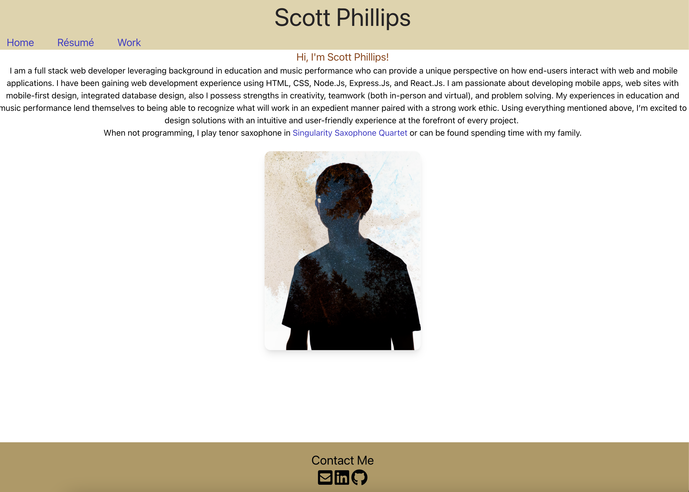
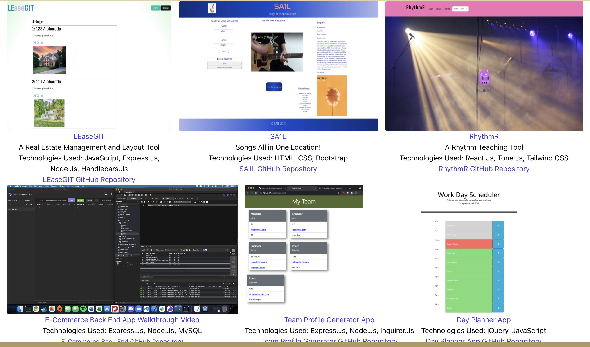

# Portfolio

## Table of Contents

*[Description](#description)

*[Usage](#usage)

*[Contributing](#contributing)

*[Tests](#tests)

*[Questions](#questions)

## Description

This page displays a portfolio of my work or projects I have participated in as a web designer to showcase for potential employers, utilizing React.Js and Tailwind CSS

## Installation

To install necessary dependencies, run the following command:
...
npm i
...

## Usage

The page can be accessed through the url https://scottydphillips.github.io/react-portfolio

## Contributing

Feedback is accepted; however, as this is my personal portfolio, contributions will not.

## Tests

To run tests, run the following command:
...
npm test
...

## Questions

If you have any questions about the repo, open an issue or contact me directly at scotty.d.phillips@gmail.com. You can find more of my work at https://github.com/scottydphillips

Link to Deployed Page: https://scottydphillips.github.io/react-portfolio

## Screenshots

